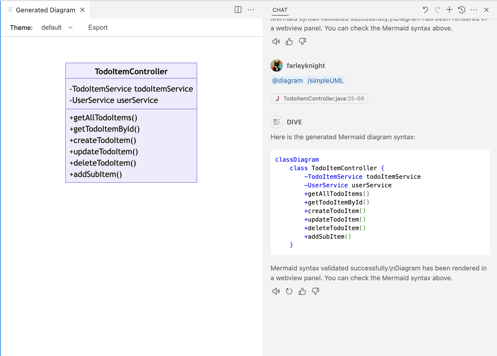
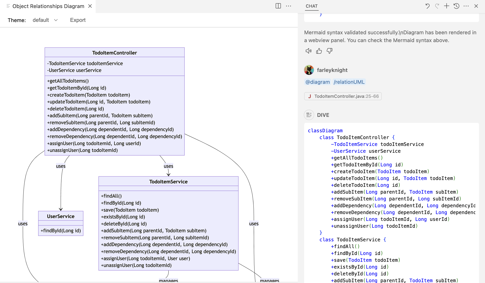
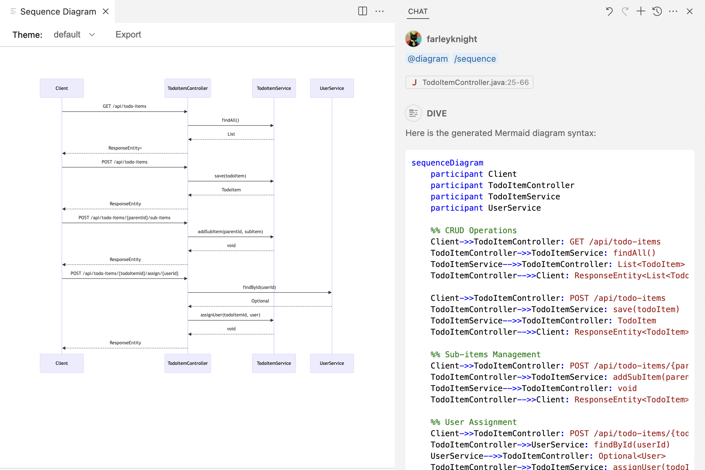
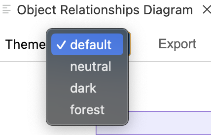
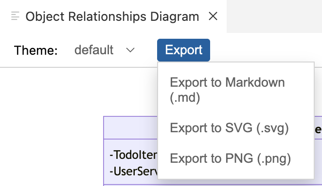

# Diagram Illustration & Visualization Engine (DIVE)

This Visual Studio Code extension integrates with GitHub Copilot Chat to help you generate diagrams directly within the editor. Using the `@diagram` chat participant, you can create various diagrams based on your code or natural language descriptions.

Key features include:

*   **Diagram Generation:** Create Mermaid diagrams (flowcharts, class diagrams, sequence diagrams, relationship diagrams) by interacting with the `@diagram` chat participant.
*   **Slash Commands:** Use commands like `/simpleUML`, `/relationUML`, and `/sequence` for quick diagram generation from the active editor's code.
*   **Code Analysis:** The extension analyzes your code context to generate relevant diagrams.
*   **Diagram Rendering:** Renders generated Mermaid diagrams in a VS Code Webview panel.
*   **Theme Selection:** Allows choosing different themes for the rendered Mermaid diagrams.
*   **Save Functionality:** Save diagrams as `.mmd`, `.md`, `.svg`, or `.png` files using the `Export` feature
    *   **Note:** Exporting to `.svg` or `.png` requires the Mermaid CLI (`mmdc`) to be installed globally. If you don't have it, you can install it using npm:
        ```bash
        npm install -g @mermaid-js/mermaid-cli
        ```

## Class Diagram Example (`@diagram /simpleUML`)



## Class Diagram Example (`@diagram /relationUML`)



## Sequence Diagram Example (`@diagram /sequence`)



## Theme Selection



## Export Formats



## Installation Instructions

This extension is currently distributed as a VSIX package. To install:

### Option 1: Using VS Code UI

1. Download the VSIX file from the provided link or location
2. Open VS Code
3. Go to the Extensions view (click the Extensions icon in the Activity Bar or press `Ctrl+Shift+X`)
4. Click the "..." (More Actions) menu at the top of the Extensions view
5. Select "Install from VSIX..."
6. Browse to and select the downloaded VSIX file
7. Reload VS Code when prompted

### Option 2: Using Command Line

1. Download the VSIX file from the provided link or location
2. Open a terminal/command prompt
3. Run the following command:
   ```
   code --install-extension path/to/dive-extension.vsix
   ```
   (Replace `path/to/dive-extension.vsix` with the actual path to the downloaded VSIX file)

### Requirements

- Visual Studio Code 1.85.0 or higher
- GitHub Copilot Chat extension (for full functionality)
- For exporting to SVG/PNG: Mermaid CLI (`mmdc`) installed globally